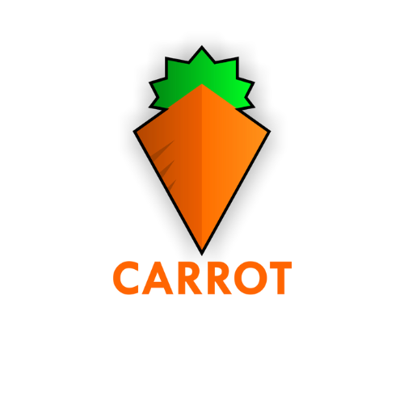

<div align="center">
  
  
  # محرك بحث كاروت كو 🥕
  
  #### محرك بحث عربي ذكي مدعوم بتقنية Gemini AI 

  [](https://replit.com/@IslamIbrahim/CarrotSearchEngine)
  [](https://replit.com/@IslamIbrahim/CarrotSearchEngine)
</div>

## 🌟 المميزات الرئيسية

- 🔍 بحث ذكي في المحتوى العربي
- 🤖 تلخيص النتائج باستخدام Gemini AI
- 🎯 اقتراحات بحث ذكية
- 📱 تصميم متجاوب مع جميع الأجهزة
- 🌓 وضع داكن/فاتح
- ⚡ أداء سريع وسلس

## 🏗️ هيكل المشروع

```
├── client/               # واجهة المستخدم (React + TypeScript)
│   ├── src/
│   │   ├── components/   # مكونات واجهة المستخدم
│   │   ├── pages/       # صفحات التطبيق
│   │   └── hooks/       # React Hooks
│
├── server/              # الخدمة الخلفية (Node.js + Express)
│   ├── plugins/         # نظام الإضافات
│   └── routes/         # مسارات API
│
├── docs/               # التوثيق
└── shared/            # الأنماط والثوابت المشتركة
```

## 🚀 كيفية البدء

### المتطلبات الأساسية

- Node.js (v18 أو أحدث)
- npm (v9 أو أحدث)

### خطوات التشغيل

1. تثبيت الاعتماديات:
```bash
npm install
```

2. تشغيل المشروع:
```bash
npm run dev
```

## 🔌 نظام الإضافات

يدعم المحرك إضافة مصادر بحث جديدة من خلال نظام الإضافات:

- 📺 يوتيوب
- 📚 ويكيبيديا
- 🔍 محركات بحث أخرى
- 📄 ملفات PDF

## 👥 فريق العمل

<div align="center">
  
  
  ### م. إسلام إبراهيم
  مؤسس ومطور رئيسي
</div>

## 📄 الترخيص

هذا المشروع مرخص تحت [MIT License](https://opensource.org/licenses/MIT)

---

<div align="center">
  صنع بـ ❤️ في مصر 🇪🇬
</div>
